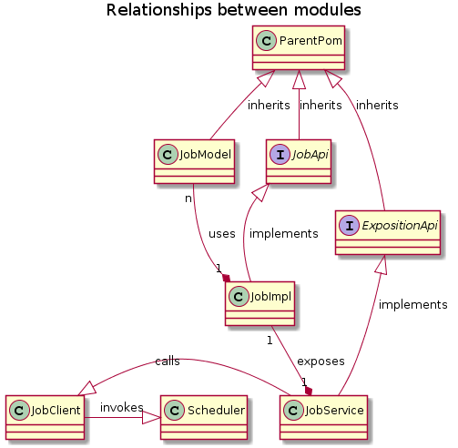

#Introduction

Feature: Given a job, we want to be able to execute a job on regular scheduled (similar to crontab)
Assumption:
- The job model and corresponding REST API are implemented (for example POST
/jobs/:id/execution )
- The scheduler component must be reusable in other contexts/products/projects.
- We can assume to build component in java (but it's not a must).
Goal:
- Design a solution from the code organization to deployment.
- You can propose alternative solutions depending on criteria you may find important for your
architecture decision.

## Description of the solution

### Code organization

Supposing we want wo develop in a future several scheduled works following both the model and api endpoints structure, 
 and basing the development in Java, I would purpose Maven as the building and code managing tool.
 
 We'd design a parent pom that should be included by all the java projects from now on, in which I'd set up a battery of 
plugins dedicated to enforce future "son" projects to follow some quality and organizational requisites:

* format of source files, jdk version
* generation of artifacts (enforcing in example, to generate a new artifact with the source code, very useful in case of consulting, 
or debugging).
* management of versions (enforcing not to mix snapshots in a release pom, i.e ) 
* plugins for measuring quality of tests (enforcing high values for the percentage of code "visited" by the tests), stopping the construction of 
 artifacts when minimum values are not reached.
* plugins for searching code smells (stopping the construction if found).
* common code formatting plugins, for easiness of code reading.
* documentation plugins, helping to generate in each construction an updated version of the documentation associated with the code.
* plugins for code analysis, searching for potential bugs.
* plugins for checking style of coding, avoiding common bad programming habits.
* plugins for searching for potential vulnerabilities (maybe attached to a release generation phase more than the usual coding phase). Several examples exists, 
able to communicate with public databases of vulnerabilities very frecuently updated.
* plugins for measuring the performance of the jobs (collecting statistics and saving or publishing them to a continuous construction pipeline)

 Based on the vulnerabilities found in previous phases, or in desired upgraded of the technology stack (i.e. moving from SpringFramework 4 to 5),
  at least I'd provide a BOM pom.xml file with the dependencies versions in order to be used by the rest of the projects (avoiding different dependencies of the same products coexisting at the same runtime)
  
### Job model

It's supposed that the framework to be designed will help developers to create jobs with a common structure. Hence, a proper model should be provided in its self artifact, in order to be included
 by all projects implementing a new job, as a way to represent the same way all request, responses and exceptions to handle and share between services/projects. 
 
 This dependency will have the necessary classes representing the model and the annotations and dependencies needed for validating requests and 
  responses, along with the pre or postprocessing instructions for helping in the distribution of the beans/pojo between services.
  
### Job api

A job api should be provided as an artifact also, containing the basic interface a job must accomplish, and representing the request/responses operations that the job can offer.

### Exposing api

This module should contain the needed configuration to transform the previously described api into a REST api, WSDL api, Grpc, api...
 In my opinion there should be one by each service technology. Could contain annotations, for integrating into a MVC application, a Reactor application....
 
### Job implementation

Each different job should be packaged in its own module, being able to provide the functionality expected in a non container but dependency way.

### Job Service

A service should be considered as the final runtime exposition of the job implementation, so a Service artifact could expose a way to communicate with the job.
 The expected communication could be any of the above exposed (rest, wsdl...) being the Service a self contained application or a module to be deployed in other system.
 
### Job Client

The job client should be a module in charge of making the call for some concrete job to be launched, offering the result in any desired format.

### Scheduler

This module will be included in an artifact in a way that it can be used by any Job Client that needs to be called in an scheduled way for 
 launching a concrete job client.    
 
 
## Code organization schema

In this picture you can see the relationship between the different pieces.

 